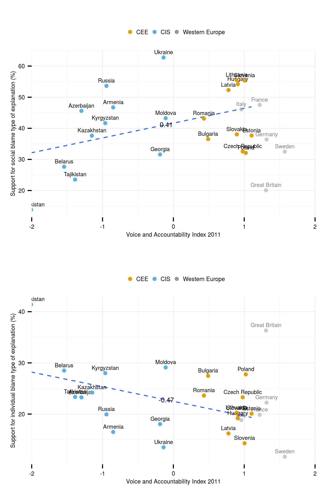

`generated at:`
```{r, echo=FALSE}
Sys.time()
```
---

<link href="http://markuskainu.fi/material/css/rmarkdown.css" rel="stylesheet" type="text/css" title="compact"></link> <link href='http://fonts.googleapis.com/css?family=Oswald' rel='stylesheet' type='text/css'>


```{r, eval=FALSE, echo=FALSE}
setwd("~/workspace/lits/attrib/attrib_year2013/code/")
library(kaRski)
knitpandoc("descriptive_analysis")

```


```{roptsattrib, echo=FALSE}
opts_chunk$set(echo=TRUE,eval=TRUE, cache=TRUE,message=FALSE,warning=FALSE,fig.width=12,fig.height=12)
```

<link href="http://markuskainu.fi/material/css/article_wide.css" rel="stylesheet" type="text/css" title="compact"></link>

# Visualizing the predictors

## Perceived income

### Original variable

```{rdescplot1_1, fig.width=15}
load("~/workspace/data/lits2.RData")
library(ggplot2)
library(reshape2)

df$cntry <- factor(df$cntry)
tbl <- data.frame(prop.table(table(df$cntry,df$q227),1)*100)
reg <- as.data.frame(table(df$cntry,df$group))
reg <- subset(reg, Freq > 0)
reg <- reg[with(reg, order(Var2)), ]
x <- merge(tbl,reg[,1:2],by="Var1")
names(x) <- c("cntry","cond","freq","group")

x <- x[with(x, order(cond)), ]
x$cond <- as.numeric(levels(x$cond))[x$cond]
x <- subset(x, cond >= -1)
x$cntry <- factor(x$cntry, levels=reg$Var1)

ggplot(x, aes(x=cntry, y=freq, fill=cond)) +
  geom_bar(stat="identity") +
  facet_grid(group~.) + theme(axis.text.x = element_text(angle = 90, vjust = 0.5))
```

#### Transformed variable

```{rdescplot1_2, fig.width=15}
df$cntry <- factor(df$cntry)
tbl <- data.frame(prop.table(table(df$cntry,df$income),1)*100)
reg <- as.data.frame(table(df$cntry,df$group))
reg <- subset(reg, Freq > 0)
reg <- reg[with(reg, order(Var2)), ]
x <- merge(tbl,reg[,1:2],by="Var1")
names(x) <- c("cntry","cond","freq","group")
x$cond <- factor(x$cond, levels=c("Low","High"))

x <- x[with(x, order(cond)), ]
x$cntry <- factor(x$cntry, levels=reg$Var1)

ggplot(x, aes(x=cntry, y=freq, fill=cond)) +
  geom_bar(stat="identity") +
  facet_grid(group~.) + theme(axis.text.x = element_text(angle = 90, vjust = 0.5))
```

## Transfer dependency/Income source

### Original variable

```{rdescplot2_1, fig.width=15}
df$cntry <- factor(df$cntry)
tbl <- data.frame(prop.table(table(df$cntry,df$q226m_txt),1)*100)
reg <- as.data.frame(table(df$cntry,df$group))
reg <- subset(reg, Freq > 0)
reg <- reg[with(reg, order(Var2)), ]
x <- merge(tbl,reg[,1:2],by="Var1")
names(x) <- c("cntry","cond","freq","group")

x <- x[with(x, order(cond)), ]
x$cntry <- factor(x$cntry, levels=reg$Var1)

ggplot(x, aes(x=cntry, y=freq, fill=cond)) +
  geom_bar(stat="identity") +
  facet_grid(group~.) + theme(axis.text.x = element_text(angle = 90, vjust = 0.5))
```

### Transformed variable

```{rdescplot2_2, fig.width=15}

df$cntry <- factor(df$cntry)
tbl <- data.frame(prop.table(table(df$cntry,df$incsour3),1)*100)
reg <- as.data.frame(table(df$cntry,df$group))
reg <- subset(reg, Freq > 0)
reg <- reg[with(reg, order(Var2)), ]
x <- merge(tbl,reg[,1:2],by="Var1")
names(x) <- c("cntry","cond","freq","group")
x$cond <- factor(x$cond, levels=c("Dependent","Not.dependent"))

x <- x[with(x, order(cond)), ]
x$cntry <- factor(x$cntry, levels=reg$Var1)

ggplot(x, aes(x=cntry, y=freq, fill=cond)) +
  geom_bar(stat="identity") +
  facet_grid(group~.) + theme(axis.text.x = element_text(angle = 90, vjust = 0.5))
```


## Past

### Original variable

```{rdescplot3_1, fig.width=15}
df$cntry <- factor(df$cntry)
tbl <- data.frame(prop.table(table(df$cntry,df$q228),1)*100)
reg <- as.data.frame(table(df$cntry,df$group))
reg <- subset(reg, Freq > 0)
reg <- reg[with(reg, order(Var2)), ]
x <- merge(tbl,reg[,1:2],by="Var1")
names(x) <- c("cntry","cond","freq","group")

x <- x[with(x, order(cond)), ]
x$cond <- as.numeric(levels(x$cond))[x$cond]
x <- subset(x, cond >= -1)
x$cntry <- factor(x$cntry, levels=reg$Var1)

ggplot(x, aes(x=cntry, y=freq, fill=cond)) +
  geom_bar(stat="identity") +
  facet_grid(group~.) + theme(axis.text.x = element_text(angle = 90, vjust = 0.5))
```

### Transformed variable

```{rdescplot3_2, fig.width=15}

tbl <- data.frame(prop.table(table(df$cntry,df$past),1)*100)
reg <- as.data.frame(table(df$cntry,df$group))
reg <- subset(reg, Freq > 0)
reg <- reg[with(reg, order(Var2)), ]
x <- merge(tbl,reg[,1:2],by="Var1")
names(x) <- c("cntry","cond","freq","group")
x$cond <- factor(x$cond, levels=c("same or better","worse"))

x <- x[with(x, order(cond)), ]
x$cntry <- factor(x$cntry, levels=reg$Var1)

ggplot(x, aes(x=cntry, y=freq, fill=cond)) +
  geom_bar(stat="identity") +
  facet_grid(group~.) + theme(axis.text.x = element_text(angle = 90, vjust = 0.5))
```


## Future

### Original variable

```{rdescplot4_1, fig.width=15}
df$cntry <- factor(df$cntry)
tbl <- data.frame(prop.table(table(df$cntry,df$q229),1)*100)
reg <- as.data.frame(table(df$cntry,df$group))
reg <- subset(reg, Freq > 0)
reg <- reg[with(reg, order(Var2)), ]
x <- merge(tbl,reg[,1:2],by="Var1")
names(x) <- c("cntry","cond","freq","group")

x <- x[with(x, order(cond)), ]
x$cond <- as.numeric(levels(x$cond))[x$cond]
x <- subset(x, cond >= -1)
x$cntry <- factor(x$cntry, levels=reg$Var1)

ggplot(x, aes(x=cntry, y=freq, fill=cond)) +
  geom_bar(stat="identity") +
  facet_grid(group~.) + theme(axis.text.x = element_text(angle = 90, vjust = 0.5))
```

### Transformed variable

```{rdescplot4_2, fig.width=15}

tbl <- data.frame(prop.table(table(df$cntry,df$future),1)*100)
reg <- as.data.frame(table(df$cntry,df$group))
reg <- subset(reg, Freq > 0)
reg <- reg[with(reg, order(Var2)), ]
x <- merge(tbl,reg[,1:2],by="Var1")
names(x) <- c("cntry","cond","freq","group")
x$cond <- factor(x$cond, levels=c("same or better","worse"))

x <- x[with(x, order(cond)), ]
x$cntry <- factor(x$cntry, levels=reg$Var1)

ggplot(x, aes(x=cntry, y=freq, fill=cond)) +
  geom_bar(stat="identity") +
  facet_grid(group~.) + theme(axis.text.x = element_text(angle = 90, vjust = 0.5))
```


## Education

### Original variable

```{rdescplot5_1, fig.width=15}
df$cntry <- factor(df$cntry)
tbl <- data.frame(prop.table(table(df$cntry,df$q515),1)*100)
reg <- as.data.frame(table(df$cntry,df$group))
reg <- subset(reg, Freq > 0)
reg <- reg[with(reg, order(Var2)), ]
x <- merge(tbl,reg[,1:2],by="Var1")
names(x) <- c("cntry","cond","freq","group")

x <- x[with(x, order(cond)), ]
x$cond <- as.numeric(levels(x$cond))[x$cond]
x <- subset(x, cond >= -1)
x$cntry <- factor(x$cntry, levels=reg$Var1)

ggplot(x, aes(x=cntry, y=freq, fill=cond)) +
  geom_bar(stat="identity") +
  facet_grid(group~.) + theme(axis.text.x = element_text(angle = 90, vjust = 0.5))
```

### Transformed variable

```{rdescplot5_2, fig.width=15}

tbl <- data.frame(prop.table(table(df$cntry,df$edu2),1)*100)
reg <- as.data.frame(table(df$cntry,df$group))
reg <- subset(reg, Freq > 0)
reg <- reg[with(reg, order(Var2)), ]
x <- merge(tbl,reg[,1:2],by="Var1")
names(x) <- c("cntry","cond","freq","group")
x$cond <- factor(x$cond, levels=c("no or compulsory","higher"))

x <- x[with(x, order(cond)), ]
x$cntry <- factor(x$cntry, levels=reg$Var1)

ggplot(x, aes(x=cntry, y=freq, fill=cond)) +
  geom_bar(stat="identity") +
  facet_grid(group~.) + theme(axis.text.x = element_text(angle = 90, vjust = 0.5))
```


## Crises

### Original variable

```{rdescplot6_1, fig.width=15}
df$cntry <- factor(df$cntry)
tbl <- data.frame(prop.table(table(df$cntry,df$q801),1)*100)
reg <- as.data.frame(table(df$cntry,df$group))
reg <- subset(reg, Freq > 0)
reg <- reg[with(reg, order(Var2)), ]
x <- merge(tbl,reg[,1:2],by="Var1")
names(x) <- c("cntry","cond","freq","group")

x <- x[with(x, order(cond)), ]
x$cntry <- factor(x$cntry, levels=reg$Var1)

ggplot(x, aes(x=cntry, y=freq, fill=cond)) +
  geom_bar(stat="identity") +
  facet_grid(group~.) + theme(axis.text.x = element_text(angle = 90, vjust = 0.5)) +
  scale_fill_manual(values=c("red","orange","yellow","green","dim grey","grey"))
  
```

### Transformed variable

```{rdescplot6_2, fig.width=15}

tbl <- data.frame(prop.table(table(df$cntry,df$crise),1)*100)
reg <- as.data.frame(table(df$cntry,df$group))
reg <- subset(reg, Freq > 0)
reg <- reg[with(reg, order(Var2)), ]
x <- merge(tbl,reg[,1:2],by="Var1")
names(x) <- c("cntry","cond","freq","group")
x$cond <- factor(x$cond, levels=c("Little or not at all","Great or fair amount"))

x <- x[with(x, order(cond)), ]
x$cntry <- factor(x$cntry, levels=reg$Var1)

ggplot(x, aes(x=cntry, y=freq, fill=cond)) +
  geom_bar(stat="identity") +
  facet_grid(group~.) + theme(axis.text.x = element_text(angle = 90, vjust = 0.5))
  
```


## Macro level

```{rdescplot7, fig.width=15}
df <- macro[with(macro, order(uw.gini)), ]
df$cntry <- factor(df$cntry, levels=df$cntry)
ggplot(df, aes(x=cntry,y=uw.gini, colour=group)) +
  geom_point(size=5) +
  labs(title="gini coeficient") +
  theme(axis.text.x = element_text(angle = 90, vjust = 0.5))
```

```{rdescplot8, fig.width=15}
df <- macro[with(macro, order(gdpchange07.10)), ]
df$cntry <- factor(df$cntry, levels=df$cntry)
ggplot(df, aes(x=cntry,y=gdpchange07.10, colour=group)) +
  geom_point(size=5) +
  labs(title="gdp change 2007 - 2010") +
  theme(axis.text.x = element_text(angle = 90, vjust = 0.5))
```

```{rdescplot9, fig.width=15}
df <- macro[with(macro, order(wbgi.vae)), ]
df$cntry <- factor(df$cntry, levels=df$cntry)

ggplot(df, aes(x=cntry,y=wbgi.vae, colour=group)) +
  geom_point(size=5) +
    labs(title="Voice and accountability") +
  theme(axis.text.x = element_text(angle = 90, vjust = 0.5))
```

```{rdescplot10, fig.width=15}
library(GGally)
ggpairs(macro[, c("uw.gini", "gdpchange07.10", "wbgi.vae","social.blame","individual.blame")])

```


# Final plots



