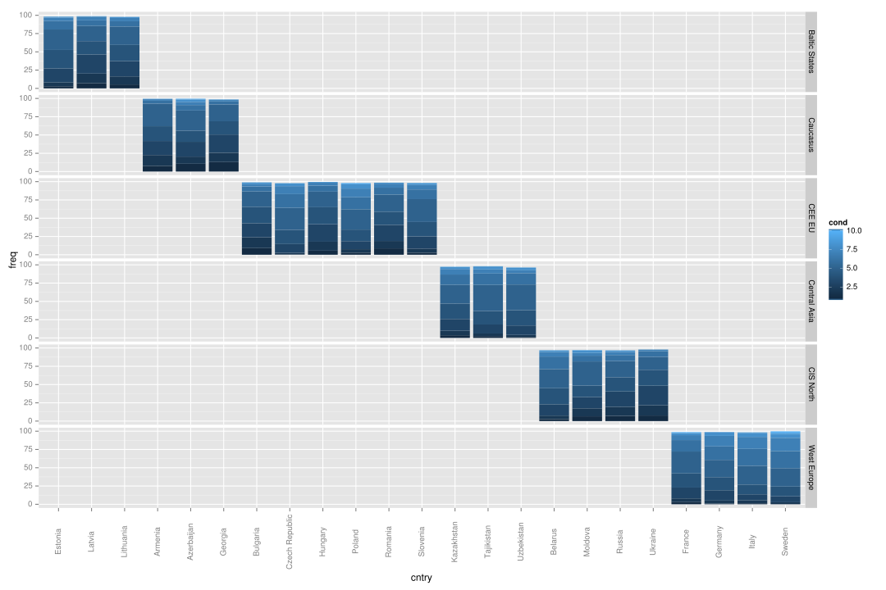
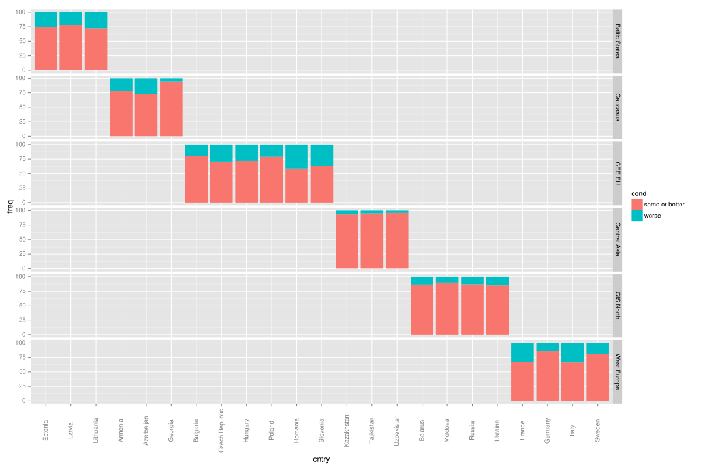
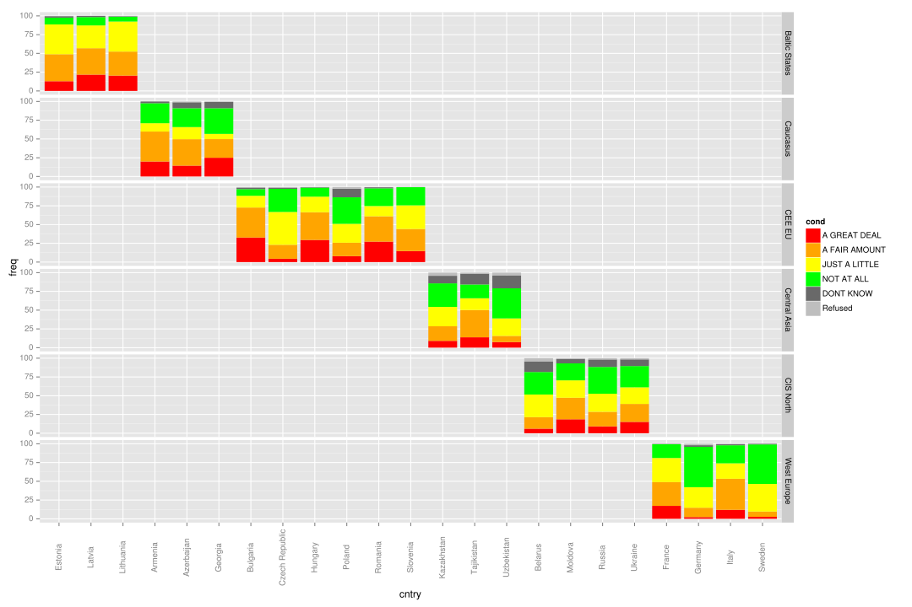
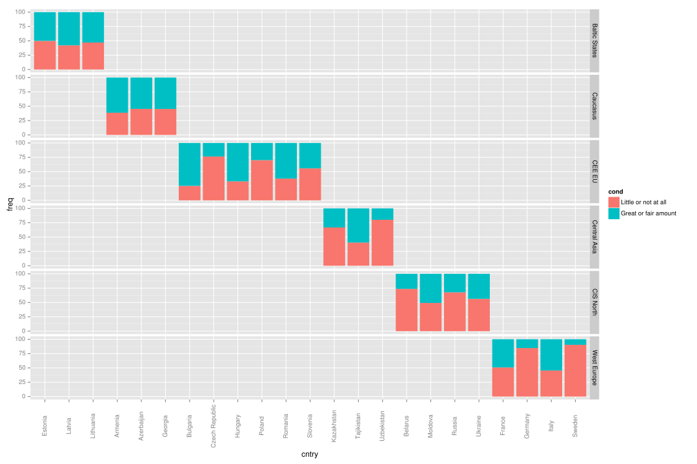

<link href="http://markuskainu.fi/material/css/article_wide.css" rel="stylesheet" type="text/css" title="compact"></link>

# Visualizing the predictors

## Perceived income

### Original variable

 

#### Transformed variable

 

## Transfer dependency/Income source

### Original variable

 

### Transformed variable

 

## Past

### Original variable

 

### Transformed variable

 

## Future

### Original variable

 

### Transformed variable

 

## Education

### Original variable

 

### Transformed variable

 

## Crises

### Original variable

 

### Transformed variable

 

## Macro level

 

 

 

 

# Final plots

