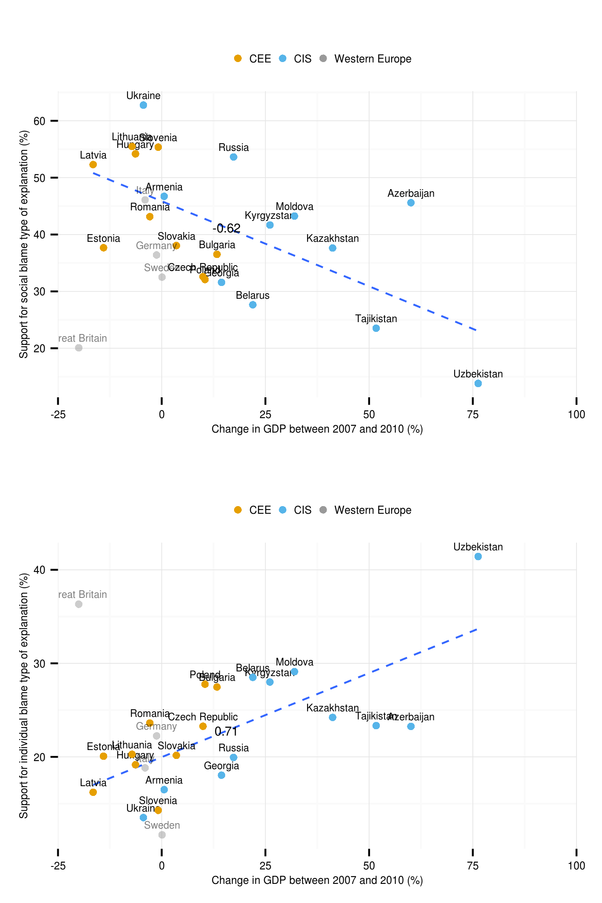
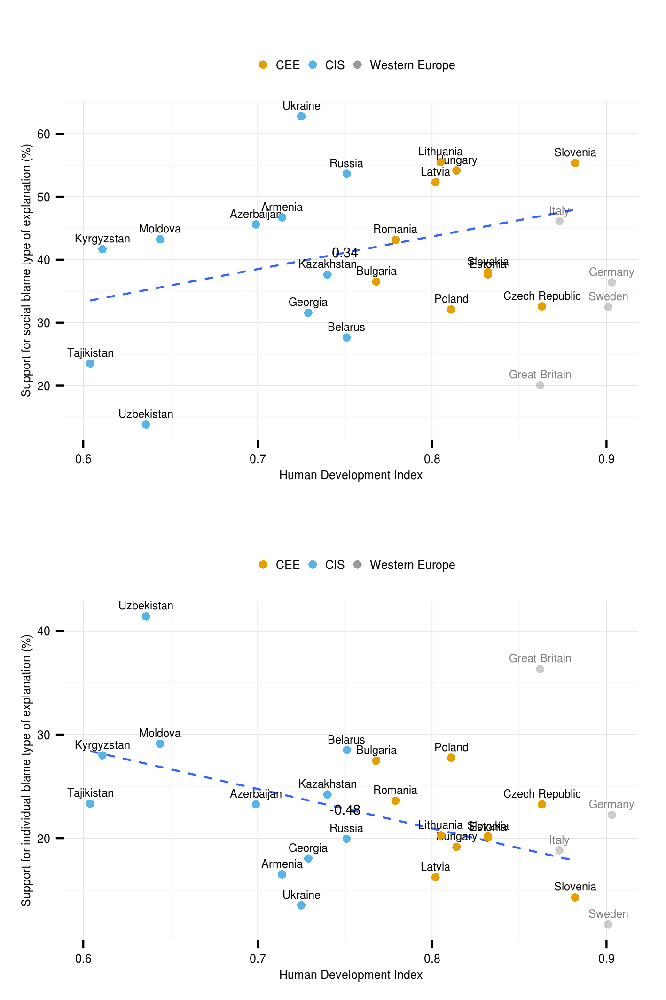
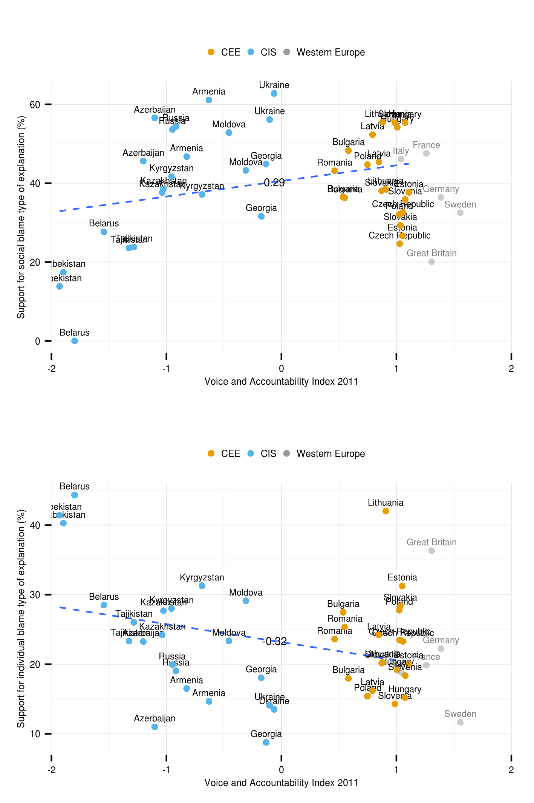
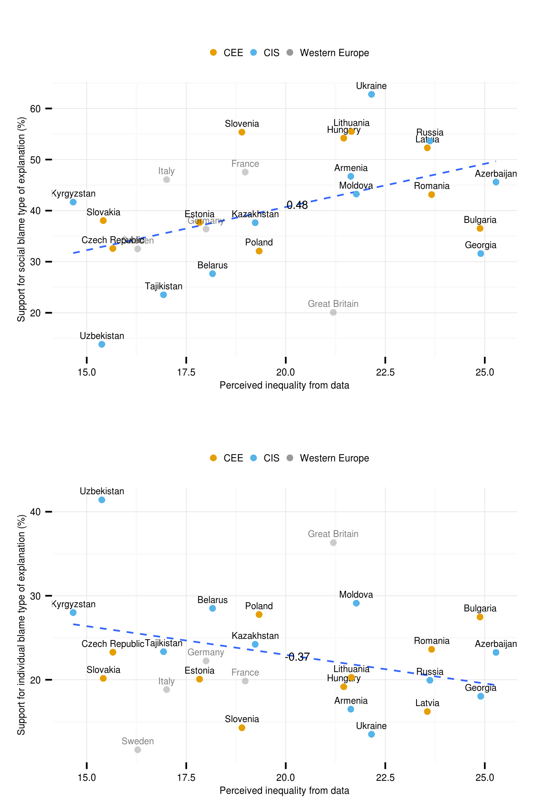

# Final graphics for the paper


```{roptsattrib, echo=FALSE}
opts_chunk$set(echo=FALSE,eval=TRUE, cache=TRUE,message=FALSE,warning=FALSE,fig.width=12,fig.height=10)
```


```{rattribFinalPlotsLoad}
library(ggplot2)
library(gridExtra)
library(plyr)
library(grid)
#########################################
#########################################
setwd("~/workspace/lits/attributions")
#########################################
cbPalette <- c("#E69F00","#56B4E9","#999999","#009E73", "#F0E442", "#0072B2","#D55E00", "#CC79A7")


#########################################
load("~/workspace/lits/attributions/data/lits.RData")


```

# Scatterplots

## GDP change

```{rattribFinalPlotsGDP}


# valitaan vaan kohdemaat #
t3 <- subset(macro, group_fine != 'West Europe' & year == 2010)
west <- subset(macro, group_fine == 'West Europe' & year == 2010)
#t3 <- macro
#########################################
t3$group1 <- "group1"
func <- function(t3)
{
  return(data.frame(COR = cor(t3$socialBlame, t3$gdpChange)))
}
df.cor <- ddply(t3, .(group1), func)
t4 <- join(t3,df.cor,by="group1")
cnames <- round(stats:::aggregate.formula(cbind(socialBlame, gdpChange) ~ COR, data=t4, mean),2)
  
plot1 <- ggplot(t4, aes(x=gdpChange, y=socialBlame, 
                        label=cntry)) +
  geom_smooth(method=lm, se=FALSE,  alpha=.5, linetype="dashed", size=0.5) +  
  geom_text(data=cnames, aes(gdpChange,socialBlame, label = COR, group=COR), 
            size=2.5, color="black") +
  geom_text(size=2, vjust=-0.8, hjust=0.5) +
  geom_point(size=1.5) +
  geom_point(data=t4, aes(x=gdpChange, 
                          y=socialBlame, color=group_general)) +
  # west reference
  geom_point(data=west, aes(x=gdpChange, 
                          y=socialBlame, 
                            color=group_general), alpha=.5) +
  geom_text(data=west, aes(x=gdpChange, 
                           y=socialBlame, label=cntry),
             alpha=.5, size=2, vjust=-0.8, hjust=0.5) +
  # west reference
  labs(x = "Change in GDP between 2007 and 2010 (%)", 
       y = "Support for social blame type of explanation (%)") + 
  scale_colour_manual(values=cbPalette) +
  coord_cartesian(xlim=c(-25,100)) +
  theme_minimal() +
  theme(legend.title=element_blank()) +
  theme(legend.text=element_text(size=6)) +
  theme(legend.position="top") +
  theme(axis.title.y = element_text(size=6)) +
  theme(axis.title.x = element_text(size=6)) +
  theme(axis.text.y = element_text(size=6)) +
  theme(axis.text.x = element_text(size=6)) +
  #guides(color = guide_legend(nrow = 2)) +
  theme(legend.key.size = unit(3, "mm"))


func <- function(t3)
{
  return(data.frame(COR = cor(t3$individualBlame, t3$gdpChange)))
}
df.cor <- ddply(t3, .(group1), func)
t4 <- join(t3,df.cor,by="group1")
cnames <- round(stats:::aggregate.formula(cbind(individualBlame, gdpChange) ~ COR, data=t4, mean),2)
plot2 <- ggplot(t4, aes(x=gdpChange, 
                        y=individualBlame, label=cntry)) +
  geom_smooth(method=lm, se=FALSE,  alpha=.5, linetype="dashed", size=0.5) +  
  geom_text(size=2, vjust=-0.8, hjust=0.5, color="black") +
  geom_text(data=cnames, aes(gdpChange,individualBlame, label = COR, group=COR), 
            size=2.5, color="black") +
  geom_point(size=1.5) +
  geom_point(data=t4, aes(x=gdpChange, 
             y=individualBlame, color=group_general)) +
  # west reference
  geom_point(data=west, aes(x=gdpChange, 
                            y=individualBlame, 
                            color=group_general), alpha=.5) +
  geom_text(data=west, aes(x=gdpChange, 
                           y=individualBlame, label=cntry),
             alpha=.5, size=2, vjust=-0.8, hjust=0.5) +
  # west reference
  labs(x = "Change in GDP between 2007 and 2010 (%)", 
       y = "Support for individual blame type of explanation (%)") +
  scale_colour_manual(values=cbPalette) +
  coord_cartesian(xlim=c(-25,100)) +
  theme_minimal() +
  theme(legend.title=element_blank()) +
  theme(legend.text=element_text(size=6)) +
  theme(legend.position="top") +
  theme(axis.title.y = element_text(size=6)) +
  theme(axis.title.x = element_text(size=6)) +
  theme(axis.text.y = element_text(size=6)) +
  theme(axis.text.x = element_text(size=6)) +
  #guides(color = guide_legend(nrow = 2)) +
  theme(legend.key.size = unit(3, "mm"))

pdf("figure/scatter_gdp.pdf", width=12/2.54, height=18/2.54)
grid.arrange(plot1,plot2, ncol=1)
dev.off()

ppi <- 300
png("figure/scatter_gdp.png", width=12/2.54*ppi, height=18/2.54*ppi, res=ppi)
grid.arrange(plot1,plot2, ncol=1)
dev.off()

png("figure/scatter_gdpSB.png", width=12/2.54*ppi, height=8/2.54*ppi, res=ppi)
plot1
dev.off()
png("figure/scatter_gdpIB.png", width=12/2.54*ppi, height=8/2.54*ppi, res=ppi)
plot2
dev.off()


```




## UNDP HDI


```{rattribFinalPlotsHDI, eval=FALSE}
# UNU-Wider Gini

func <- function(t3)
{
  return(data.frame(COR = cor(t3$socialBlame, t3$undp_hdi)))
}
df.cor <- ddply(t3, .(group1), func)
t4 <- join(t3,df.cor,by="group1")
cnames <- round(stats:::aggregate.formula(cbind(socialBlame, undp_hdi) ~ COR, data=t4, mean),2)
plot1 <- ggplot(t4, aes(x=undp_hdi, y=socialBlame, label=cntry)) +
  geom_smooth(method=lm, se=FALSE,  alpha=.5, linetype="dashed", size=0.5) +  
  geom_text(size=2, vjust=-0.8, hjust=0.5) +
  geom_text(data=cnames, aes(undp_hdi,socialBlame, label = COR, group=COR), 
            size=2.5, color="black") +
  labs(x = "Human Development Index", 
       y = "Support for social blame type of explanation (%)") +
  geom_point(size=1.5) +
  geom_point(data=t4, aes(x=undp_hdi, 
                          y=socialBlame, color=group_general)) +
  # west reference
  geom_point(data=west, aes(x=undp_hdi, 
                            y=socialBlame, 
                            color=group_general), alpha=.5) +
  geom_text(data=west, aes(x=undp_hdi, 
                           y=socialBlame, label=cntry),
             alpha=.5, size=2, vjust=-0.8, hjust=0.5) +
  # west reference
  scale_colour_manual(values=cbPalette) +
  #coord_cartesian(xlim=c(20,60)) +
  theme_minimal() +
  theme(legend.title=element_blank()) +
  theme(legend.text=element_text(size=6)) +
  theme(legend.position="top") +
  theme(axis.title.y = element_text(size=6)) +
  theme(axis.title.x = element_text(size=6)) +
  theme(axis.text.y = element_text(size=6)) +
  theme(axis.text.x = element_text(size=6)) +
  #guides(color = guide_legend(nrow = 2)) +
  theme(legend.key.size = unit(3, "mm"))

func <- function(t3)
{
  return(data.frame(COR = cor(t3$individualBlame, t3$undp_hdi)))
}
df.cor <- ddply(t3, .(group1), func)
t4 <- join(t3,df.cor,by="group1")
cnames <- round(stats:::aggregate.formula(cbind(individualBlame, undp_hdi) ~ COR, data=t4, mean),2)
plot2 <- ggplot(t4, aes(x=undp_hdi, y=individualBlame, label=cntry)) +
  geom_smooth(method=lm, se=FALSE,  alpha=.5, linetype="dashed", size=0.5) +  
  geom_text(size=2, vjust=-0.8, hjust=0.5) +
  geom_text(data=cnames, aes(undp_hdi,individualBlame, label = COR, group=COR), 
            size=2.5, color="black") +
  labs(x = "Human Development Index", 
       y = "Support for individual blame type of explanation (%)") +
  geom_point(size=1.5) +  
  geom_point(data=t4, aes(x=undp_hdi, 
                          y=individualBlame, color=group_general)) +
  # west reference
  geom_point(data=west, aes(x=undp_hdi, 
                            y=individualBlame, 
                            color=group_general), alpha=.5) +
  geom_text(data=west, aes(x=undp_hdi, 
                           y=individualBlame, label=cntry),
             alpha=.5, size=2, vjust=-0.8, hjust=0.5) +
  # west reference
  scale_colour_manual(values=cbPalette) +
  #coord_cartesian(xlim=c(20,60)) +
  theme_minimal() +
  theme(legend.title=element_blank()) +
  theme(legend.text=element_text(size=6)) +
  theme(legend.position="top") +
  theme(axis.title.y = element_text(size=6)) +
  theme(axis.title.x = element_text(size=6)) +
  theme(axis.text.y = element_text(size=6)) +
  theme(axis.text.x = element_text(size=6)) +
  #guides(color = guide_legend(nrow = 2)) +
  theme(legend.key.size = unit(3, "mm"))


pdf("figure/scatter_hdi.pdf", width=12/2.54, height=18/2.54)
grid.arrange(plot1,plot2, ncol=1)
dev.off()

ppi <- 300
png("figure/scatter_hdi.png", width=12/2.54*ppi, height=18/2.54*ppi, res=ppi)
grid.arrange(plot1,plot2, ncol=1)
dev.off()

png("figure/scatter_hdiSB.png", width=12/2.54*ppi, height=8/2.54*ppi, res=ppi)
plot1
dev.off()
png("figure/scatter_hdiIB.png", width=12/2.54*ppi, height=8/2.54*ppi, res=ppi)
plot2
dev.off()
```





## World Bank - Voice and Accountability

```{rattribFinalPlotsWB}

# World Bank - Voice and Accountability

func <- function(t3)
{
  return(data.frame(COR = cor(t3$socialBlame, t3$wbgi_vae)))
}
df.cor <- ddply(t3, .(group1), func)
t4 <- join(t3,df.cor,by="group1")
cnames <- round(stats:::aggregate.formula(cbind(socialBlame, wbgi_vae) ~ COR, data=t4, mean),2)
plot1 <- ggplot(t4, aes(x=wbgi_vae, y=socialBlame, 
                        label=cntry)) +
  geom_smooth(method=lm, se=FALSE,  alpha=.5, linetype="dashed", size=0.5) +
  geom_text(size=2, vjust=-0.8, hjust=0.5) +
  geom_text(data=cnames, aes(wbgi_vae,socialBlame, label = COR, group=COR), 
            size=2.5, color="black") +
  labs(x = "Voice and Accountability Index 2011", 
       y = "Support for social blame type of explanation (%)") +
  geom_point(size=1.5) +
  geom_point(data=t4, aes(x=wbgi_vae, 
                          y=socialBlame, color=group_general)) +
  # west reference
  geom_point(data=west, aes(x=wbgi_vae, 
                            y=socialBlame, 
                            color=group_general), alpha=.5) +
  geom_text(data=west, aes(x=wbgi_vae, 
                           y=socialBlame, label=cntry),
             alpha=.5, size=2, vjust=-0.8, hjust=0.5) +
  # west reference
  scale_colour_manual(values=cbPalette) +
  coord_cartesian(xlim=c(-2,2)) +
  theme_minimal() +
  theme(legend.title=element_blank()) +
  theme(legend.text=element_text(size=6)) +
  theme(legend.position="top") +
  theme(axis.title.y = element_text(size=6)) +
  theme(axis.title.x = element_text(size=6)) +
  theme(axis.text.y = element_text(size=6)) +
  theme(axis.text.x = element_text(size=6)) +
  #guides(color = guide_legend(nrow = 2)) +
  theme(legend.key.size = unit(3, "mm"))

func <- function(t3)
{
  return(data.frame(COR = cor(t3$individualBlame, t3$wbgi_vae)))
}
df.cor <- ddply(t3, .(group1), func)
t4 <- join(t3,df.cor,by="group1")
cnames <- round(stats:::aggregate.formula(cbind(individualBlame, wbgi_vae) ~ COR, data=t4, mean),2)
plot2 <- ggplot(t4, aes(x=wbgi_vae, 
                        y=individualBlame, label=cntry)) +
geom_smooth(method=lm, se=FALSE,  alpha=.5, linetype="dashed", size=0.5) +
  geom_text(size=2, vjust=-0.8, hjust=0.5) +
  geom_text(data=cnames, aes(wbgi_vae,individualBlame, label = COR, group=COR), 
            size=2.5, color="black") +
  labs(x ="Voice and Accountability Index 2011", 
       y = "Support for individual blame type of explanation (%)") +
  geom_point(size=1.5) +
  geom_point(data=t4, aes(x=wbgi_vae, 
                          y=individualBlame, color=group_general)) +
  # west reference
  geom_point(data=west, aes(x=wbgi_vae, 
                            y=individualBlame, 
                            color=group_general), alpha=.5) +
  geom_text(data=west, aes(x=wbgi_vae, 
                           y=individualBlame, label=cntry),
             alpha=.5, size=2, vjust=-0.8, hjust=0.5) +
  # west reference
  scale_colour_manual(values=cbPalette) +
  coord_cartesian(xlim=c(-2,2)) +
  theme_minimal() +
  theme(legend.title=element_blank()) +
  theme(legend.text=element_text(size=6)) +
  theme(legend.position="top") +
  theme(axis.title.y = element_text(size=6)) +
  theme(axis.title.x = element_text(size=6)) +
  theme(axis.text.y = element_text(size=6)) +
  theme(axis.text.x = element_text(size=6)) +
  #guides(color = guide_legend(nrow = 2)) +
  theme(legend.key.size = unit(3, "mm"))

pdf("figure/scatter_wbgi.pdf", width=12/2.54, height=18/2.54)
grid.arrange(plot1,plot2, ncol=1)
dev.off()

ppi <- 300
png("figure/scatter_wbgi.png", width=12/2.54*ppi, height=18/2.54*ppi, res=ppi)
grid.arrange(plot1,plot2, ncol=1)
dev.off()

png("figure/scatter_wbgiSB.png", width=12/2.54*ppi, height=8/2.54*ppi, res=ppi)
plot1
dev.off()
png("figure/scatter_wbgiIB.png", width=12/2.54*ppi, height=8/2.54*ppi, res=ppi)
plot2
dev.off()

```




## Perceived inequality from data

```{rattribFinalPlotsPG}

# Perceived inequality from data

# func <- function(t3)
# {
#   return(data.frame(COR = cor(t3$socialBlame, t3$perGini)))
# }
# df.cor <- ddply(t3, .(group1), func)
# t4 <- join(t3,df.cor,by="group1")
# cnames <- round(stats:::aggregate.formula(cbind(socialBlame, perGini) ~ COR, data=t4, mean),2)
plot1 <- ggplot(t4, aes(x=perGini, y=socialBlame, 
                        label=cntry)) +
  geom_smooth(method=lm, se=FALSE,  alpha=.5, linetype="dashed", size=0.5) +
  geom_text(size=2, vjust=-0.8, hjust=0.5) +
#   geom_text(data=cnames, aes(perGini,socialBlame, label = COR, group=COR), 
#             size=2.5, color="black") +
  labs(x = "Perceived inequality from data", 
       y = "Support for social blame type of explanation (%)") +
  geom_point(size=1.5) +
  geom_point(data=t4, aes(x=perGini, 
                          y=socialBlame, color=group_general)) +
  # west reference
  geom_point(data=west, aes(x=perGini, 
                            y=socialBlame, 
                            color=group_general), alpha=.5) +
  geom_text(data=west, aes(x=perGini, 
                           y=socialBlame, label=cntry),
             alpha=.5, size=2, vjust=-0.8, hjust=0.5) +
  # west reference
  scale_colour_manual(values=cbPalette) +
  #coord_cartesian(xlim=c(-2,2)) +
  theme_minimal() +
  theme(legend.title=element_blank()) +
  theme(legend.text=element_text(size=6)) +
  theme(legend.position="top") +
  theme(axis.title.y = element_text(size=6)) +
  theme(axis.title.x = element_text(size=6)) +
  theme(axis.text.y = element_text(size=6)) +
  theme(axis.text.x = element_text(size=6)) +
  #guides(color = guide_legend(nrow = 2)) +
  theme(legend.key.size = unit(3, "mm"))

# func <- function(t3)
# {
#   return(data.frame(COR = cor(t3$individualBlame, t3$perGini)))
# }
# df.cor <- ddply(t3, .(group1), func)
# t4 <- join(t3,df.cor,by="group1")
# cnames <- round(stats:::aggregate.formula(cbind(individualBlame, perGini) ~ COR, data=t4, mean),2)
plot2 <- ggplot(t4, aes(x=perGini, 
                        y=individualBlame, label=cntry)) +
geom_smooth(method=lm, se=FALSE,  alpha=.5, linetype="dashed", size=0.5) +
  geom_text(size=2, vjust=-0.8, hjust=0.5) +
#   geom_text(data=cnames, aes(perGini,individualBlame, label = COR, group=COR), 
#             size=2.5, color="black") +
  labs(x ="Perceived inequality from data", 
       y = "Support for individual blame type of explanation (%)") +
  geom_point(size=1.5) +
  geom_point(data=t4, aes(x=perGini, 
                          y=individualBlame, color=group_general)) +
  # west reference
  geom_point(data=west, aes(x=perGini, 
                            y=individualBlame, 
                            color=group_general), alpha=.5) +
  geom_text(data=west, aes(x=perGini, 
                           y=individualBlame, label=cntry),
             alpha=.5, size=2, vjust=-0.8, hjust=0.5) +
  # west reference
  scale_colour_manual(values=cbPalette) +
  #coord_cartesian(xlim=c(-2,2)) +
  theme_minimal() +
  theme(legend.title=element_blank()) +
  theme(legend.text=element_text(size=6)) +
  theme(legend.position="top") +
  theme(axis.title.y = element_text(size=6)) +
  theme(axis.title.x = element_text(size=6)) +
  theme(axis.text.y = element_text(size=6)) +
  theme(axis.text.x = element_text(size=6)) +
  #guides(color = guide_legend(nrow = 2)) +
  theme(legend.key.size = unit(3, "mm"))

pdf("figure/scatter_perGini.pdf", width=12/2.54, height=18/2.54)
grid.arrange(plot1,plot2, ncol=1)
dev.off()

ppi <- 300
png("figure/scatter_perGini.png", width=12/2.54*ppi, height=18/2.54*ppi, res=ppi)
grid.arrange(plot1,plot2, ncol=1)
dev.off()

png("figure/scatter_perGiniSB.png", width=12/2.54*ppi, height=8/2.54*ppi, res=ppi)
plot1
dev.off()
png("figure/scatter_perGiniIB.png", width=12/2.54*ppi, height=8/2.54*ppi, res=ppi)
plot2
dev.off()

```




```{rattribFinalPlotsMap}

library(RColorBrewer)
library(mapproj)
library(maptools)
library(rgdal)
library(grid)
map <- suppressWarnings(readOGR(dsn="/home/aurelius/data/shapefiles/lits/", 
                                layer="lits_all_simple"))

map$NAME <- as.character(map$NAME)
map$NAME[map$NAME == "United Kingdom"] <- 'Great Britain'
map$group_analysis[map$NAME %in% c('France','Germany',
                                        'Great Britain',
                                        'Italy','Sweden')] <- 'Western Europe'

map$group_analysis[map$NAME %in% c('Czech Republic','Estonia',
                                        'Hungary','Bulgaria',
                                        'Latvia','Lithuania',
                                        'Poland','Slovakia',
                                        'Slovenia','Romania')] <- 'CEE'

map$group_analysis[map$NAME %in% c('Armenia','Azerbaijan',
                                        'Belarus','Georgia',
                                        'Kazakhstan','Kyrgyzstan',
                                        'Moldova','Tajikistan',
                                        'Ukraine','Uzbekistan','Russia')] <- 'CIS'
map$NAME <- as.factor(map$NAME)

# shapefile into data.frame
map@data$id <- rownames(map@data)
library(ggplot2)
map.points <- fortify(map, region="id")
map.df <- merge(map.points, map@data, by="id")
# only east of longitude -25
map.df <- subset(map.df, long >= -15 & long <= 80)
# names for countries in analysis (excluding others)
namedata <- map.df[!is.na(map.df$group_analysis),]
cnames <- stats:::aggregate.formula(cbind(long, lat) ~ NAME, data=namedata, mean)

mapplot <- ggplot(map.df, aes(long,lat,group=group)) +
  geom_polygon(data = map.df, aes(long,lat), fill="gray90", color = "white") +
  geom_polygon(aes(fill = group_analysis)) + # or group_fine !!
  scale_fill_manual(values=cbPalette) +
  geom_polygon(data = map.df, aes(long,lat), fill=NA, color = "white", size=.3) +
  geom_text(data=cnames, aes(long, lat, label = NAME, group=NAME), size=2, color="black") +
  coord_map(project="orthographic", xlim=c(-5,80),
                ylim=c(40,60)) +
  theme_minimal() + 
  theme(legend.position="top") +
  theme(legend.title=element_blank()) +
  theme(axis.title.x = element_blank(),
        axis.title.y = element_blank()) +
  theme(axis.text.x = element_blank(),
        axis.text.y = element_blank()) +
  theme(axis.ticks.x = element_blank(),
        axis.ticks.y = element_blank()) +
  theme(legend.key.size = unit(3, "mm"))
    
    

pdf("figure/mapplot.pdf", width=12/2.54, height=7/2.54)
mapplot
dev.off()

ppi <- 300
png("figure/mapplot.png", width=15/2.54*ppi, height=9/2.54*ppi, res=ppi)
mapplot
dev.off()

```


