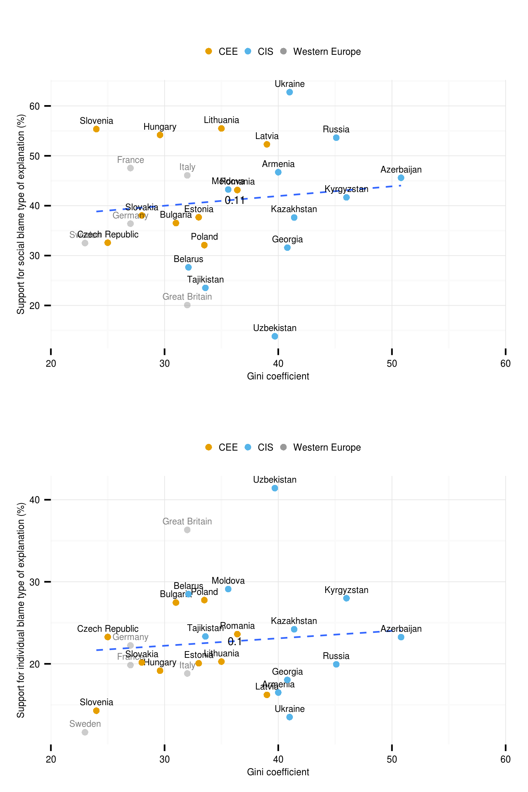

% Final graphics for the paper

- [back to index](index.html)


`generated at:`
```{r, echo=FALSE}
Sys.time()
```
---

<link href="http://markuskainu.fi/material/css/rmarkdown.css" rel="stylesheet" type="text/css" title="compact"></link> 


```{r, eval=FALSE, echo=FALSE}
setwd("~/workspace/lits/attrib/attrib_year2013/")
library(kaRski)
knit("finalPlots.Rmd")
system("pandoc -s finalPlots.md -o finalPlots.html --toc --number-section")

```


```{roptsattrib, echo=FALSE}
opts_chunk$set(echo=TRUE,eval=TRUE, cache=TRUE,message=FALSE,warning=FALSE,fig.width=12,fig.height=10)
```


```{rattribFinalPlotsLoad}
library(ggplot2)
library(gridExtra)
library(plyr)
library(grid)
#########################################
#########################################
setwd("~/workspace/lits/attrib/attrib_year2013")
#########################################
cbPalette <- c("#999999", "#E69F00", "#56B4E9", "#009E73", "#F0E442", "#0072B2", "#D55E00", "#CC79A7")
#########################################
load("~/workspace/lits/attrib/attrib_year2013/data/lits.RData")
```

# Scatterplots

## GDP change

```{rattribFinalPlotsGDP}
# valitaan vaan kohdemaat

t3 <- subset(macro, group_fine != 'West Europe')
west <- subset(macro, group_fine == 'West Europe')
#t3 <- macro
#########################################
t3$group1 <- "group1"
func <- function(t3)
{
  return(data.frame(COR = cor(t3$socialBlame, t3$gdpchange07.10)))
}
df.cor <- ddply(t3, .(group1), func)
t4 <- join(t3,df.cor,by="group1")
cnames <- round(stats:::aggregate.formula(cbind(socialBlame, gdpchange07.10) ~ COR, data=t4, mean),2)
plot1 <- ggplot(t4, aes(x=gdpchange07.10, y=socialBlame, 
                        label=cntry)) +
  geom_smooth(method=lm, se=FALSE, color="Dim Grey", linetype="dashed", size=0.5) +  
  geom_text(data=cnames, aes(gdpchange07.10,socialBlame, label = COR, group=COR), 
            size=2.5, color="black") +
  geom_text(size=2, vjust=-0.8, hjust=0.5) +
  geom_point(size=1.5) +
  geom_point(data=t4, aes(x=gdpchange07.10, 
                          y=socialBlame, color=group_general)) +
  # west reference
  geom_point(data=west, aes(x=gdpchange07.10, 
                          y=socialBlame, 
                            color=group_general), alpha=.5) +
  geom_text(data=west, aes(x=gdpchange07.10, 
                           y=socialBlame, label=cntry),
            alpha=.5, size=2, vjust=-0.8, hjust=0.5) +
  # west reference
  labs(x = "Change in GDP between 2007 and 2010 (%)", 
       y = "Support for social blame type of explanation (%)") + 
  scale_colour_manual(values=cbPalette) +
  coord_cartesian(xlim=c(-25,100)) +
  theme_minimal() +
  theme(legend.title=element_blank()) +
  theme(legend.text=element_text(size=6)) +
  theme(legend.position="top") +
  theme(axis.title.y = element_text(size=6)) +
  theme(axis.title.x = element_text(size=6)) +
  theme(axis.text.y = element_text(size=6)) +
  theme(axis.text.x = element_text(size=6)) +
  #guides(color = guide_legend(nrow = 2)) +
  theme(legend.key.size = unit(3, "mm"))


func <- function(t3)
{
  return(data.frame(COR = cor(t3$individualBlame, t3$gdpchange07.10)))
}
df.cor <- ddply(t3, .(group1), func)
t4 <- join(t3,df.cor,by="group1")
cnames <- round(stats:::aggregate.formula(cbind(individualBlame, gdpchange07.10) ~ COR, data=t4, mean),2)
plot2 <- ggplot(t4, aes(x=gdpchange07.10, 
                        y=individualBlame, label=cntry)) +
  geom_smooth(method=lm, se=FALSE, color="Dim Grey", linetype="dashed", size=0.5) +  
  geom_text(size=2, vjust=-0.8, hjust=0.5, color="black") +
  geom_text(data=cnames, aes(gdpchange07.10,individualBlame, label = COR, group=COR), 
            size=2.5, color="black") +
  geom_point(size=1.5) +
  geom_point(data=t4, aes(x=gdpchange07.10, 
             y=individualBlame, color=group_general)) +
  # west reference
  geom_point(data=west, aes(x=gdpchange07.10, 
                            y=individualBlame, 
                            color=group_general), alpha=.5) +
  geom_text(data=west, aes(x=gdpchange07.10, 
                           y=individualBlame, label=cntry),
            alpha=.5, size=2, vjust=-0.8, hjust=0.5) +
  # west reference
  labs(x = "Change in GDP between 2007 and 2010 (%)", 
       y = "Support for individual blame type of explanation (%)") +
  scale_colour_manual(values=cbPalette) +
  coord_cartesian(xlim=c(-25,100)) +
  theme_minimal() +
  theme(legend.title=element_blank()) +
  theme(legend.text=element_text(size=6)) +
  theme(legend.position="top") +
  theme(axis.title.y = element_text(size=6)) +
  theme(axis.title.x = element_text(size=6)) +
  theme(axis.text.y = element_text(size=6)) +
  theme(axis.text.x = element_text(size=6)) +
  #guides(color = guide_legend(nrow = 2)) +
  theme(legend.key.size = unit(3, "mm"))

pdf("figure/scatter_gdp.pdf", width=14/2.54, height=22/2.54)
grid.arrange(plot1,plot2, ncol=1)
dev.off()

ppi <- 300
png("figure/scatter_gdp.png", width=14/2.54*ppi, height=22/2.54*ppi, res=ppi)
grid.arrange(plot1,plot2, ncol=1)
dev.off()
```


## UNU-Wider Gini


```{rattribFinalPlotsGini}
# UNU-Wider Gini

func <- function(t3)
{
  return(data.frame(COR = cor(t3$socialBlame, t3$uw_gini)))
}
df.cor <- ddply(t3, .(group1), func)
t4 <- join(t3,df.cor,by="group1")
cnames <- round(stats:::aggregate.formula(cbind(socialBlame, uw_gini) ~ COR, data=t4, mean),2)
plot1 <- ggplot(t4, aes(x=uw_gini, y=socialBlame, label=cntry)) +
  geom_smooth(method=lm, se=FALSE, color="Dim Grey", linetype="dashed", size=0.5) +  
  geom_text(size=2, vjust=-0.8, hjust=0.5) +
  geom_text(data=cnames, aes(uw_gini,socialBlame, label = COR, group=COR), 
            size=2.5, color="black") +
  labs(x = "Gini coefficient", 
       y = "Support for social blame type of explanation (%)") +
  geom_point(size=1.5) +
  geom_point(data=t4, aes(x=uw_gini, 
                          y=socialBlame, color=group_general)) +
  # west reference
  geom_point(data=west, aes(x=uw_gini, 
                            y=socialBlame, 
                            color=group_general), alpha=.5) +
  geom_text(data=west, aes(x=uw_gini, 
                           y=socialBlame, label=cntry),
            alpha=.5, size=2, vjust=-0.8, hjust=0.5) +
  # west reference
  scale_colour_manual(values=cbPalette) +
  coord_cartesian(xlim=c(20,60)) +
  theme_minimal() +
  theme(legend.title=element_blank()) +
  theme(legend.text=element_text(size=6)) +
  theme(legend.position="top") +
  theme(axis.title.y = element_text(size=6)) +
  theme(axis.title.x = element_text(size=6)) +
  theme(axis.text.y = element_text(size=6)) +
  theme(axis.text.x = element_text(size=6)) +
  #guides(color = guide_legend(nrow = 2)) +
  theme(legend.key.size = unit(3, "mm"))

func <- function(t3)
{
  return(data.frame(COR = cor(t3$individualBlame, t3$uw_gini)))
}
df.cor <- ddply(t3, .(group1), func)
t4 <- join(t3,df.cor,by="group1")
cnames <- round(stats:::aggregate.formula(cbind(individualBlame, uw_gini) ~ COR, data=t4, mean),2)
plot2 <- ggplot(t4, aes(x=uw_gini, y=individualBlame, label=cntry)) +
  geom_smooth(method=lm, se=FALSE, color="Dim Grey", linetype="dashed", size=0.5) +  
  geom_text(size=2, vjust=-0.8, hjust=0.5) +
  geom_text(data=cnames, aes(uw_gini,individualBlame, label = COR, group=COR), 
            size=2.5, color="black") +
  labs(x = "Gini coefficient", 
       y = "Support for individual blame type of explanation (%)") +
  geom_point(size=1.5) +  
  geom_point(data=t4, aes(x=uw_gini, 
                          y=individualBlame, color=group_general)) +
  # west reference
  geom_point(data=west, aes(x=uw_gini, 
                            y=individualBlame, 
                            color=group_general), alpha=.5) +
  geom_text(data=west, aes(x=uw_gini, 
                           y=individualBlame, label=cntry),
            alpha=.5, size=2, vjust=-0.8, hjust=0.5) +
  # west reference
  scale_colour_manual(values=cbPalette) +
  coord_cartesian(xlim=c(20,60)) +
  theme_minimal() +
  theme(legend.title=element_blank()) +
  theme(legend.text=element_text(size=6)) +
  theme(legend.position="top") +
  theme(axis.title.y = element_text(size=6)) +
  theme(axis.title.x = element_text(size=6)) +
  theme(axis.text.y = element_text(size=6)) +
  theme(axis.text.x = element_text(size=6)) +
  #guides(color = guide_legend(nrow = 2)) +
  theme(legend.key.size = unit(3, "mm"))

pdf("figure/scatter_gini.pdf", width=14/2.54, height=22/2.54)
grid.arrange(plot1,plot2, ncol=1)
dev.off()

ppi <- 300
png("figure/scatter_gini.png", width=14/2.54*ppi, height=22/2.54*ppi, res=ppi)
grid.arrange(plot1,plot2, ncol=1)
dev.off()
```



## World Bank - Voice and Accountability

```{rattribFinalPlotsWB}

# World Bank - Voice and Accountability

func <- function(t3)
{
  return(data.frame(COR = cor(t3$socialBlame, t3$wbgi_vae)))
}
df.cor <- ddply(t3, .(group1), func)
t4 <- join(t3,df.cor,by="group1")
cnames <- round(stats:::aggregate.formula(cbind(socialBlame, wbgi_vae) ~ COR, data=t4, mean),2)
plot1 <- ggplot(t4, aes(x=wbgi_vae, y=socialBlame, 
                        label=cntry)) +
  geom_smooth(method=lm, se=FALSE, color="Dim Grey", linetype="dashed", size=0.5) +
  geom_text(size=2, vjust=-0.8, hjust=0.5) +
  geom_text(data=cnames, aes(wbgi_vae,socialBlame, label = COR, group=COR), 
            size=2.5, color="black") +
  labs(x = "Voice and Accountability Index 2011", 
       y = "Support for social blame type of explanation (%)") +
  geom_point(size=1.5) +
  geom_point(data=t4, aes(x=wbgi_vae, 
                          y=socialBlame, color=group_general)) +
  # west reference
  geom_point(data=west, aes(x=wbgi_vae, 
                            y=socialBlame,
                            color=group_general), alpha=.5) +
  geom_text(data=west, aes(x=wbgi_vae, 
                           y=socialBlame, label=cntry),
            alpha=.5, size=2, vjust=-0.8, hjust=0.5) +
  # west reference
  scale_colour_manual(values=cbPalette) +
  coord_cartesian(xlim=c(-2,2)) +
  theme_minimal() +
  theme(legend.title=element_blank()) +
  theme(legend.text=element_text(size=6)) +
  theme(legend.position="top") +
  theme(axis.title.y = element_text(size=6)) +
  theme(axis.title.x = element_text(size=6)) +
  theme(axis.text.y = element_text(size=6)) +
  theme(axis.text.x = element_text(size=6)) +
  #guides(color = guide_legend(nrow = 2)) +
  theme(legend.key.size = unit(3, "mm"))

func <- function(t3)
{
  return(data.frame(COR = cor(t3$individualBlame, t3$wbgi_vae)))
}
df.cor <- ddply(t3, .(group1), func)
t4 <- join(t3,df.cor,by="group1")
cnames <- round(stats:::aggregate.formula(cbind(individualBlame, wbgi_vae) ~ COR, data=t4, mean),2)
plot2 <- ggplot(t4, aes(x=wbgi_vae, 
                        y=individualBlame, label=cntry)) +
geom_smooth(method=lm, se=FALSE, color="Dim Grey", linetype="dashed", size=0.5) +
  geom_text(size=2, vjust=-0.8, hjust=0.5) +
  geom_text(data=cnames, aes(wbgi_vae,individualBlame, label = COR, group=COR), 
            size=2.5, color="black") +
  labs(x ="Voice and Accountability Index 2011", 
       y = "Support for individual blame type of explanation (%)") +
  geom_point(size=1.5) +
  geom_point(data=t4, aes(x=wbgi_vae, 
                          y=individualBlame, color=group_general)) +
  # west reference
  geom_point(data=west, aes(x=wbgi_vae, 
                            y=individualBlame, 
                            color=group_general), alpha=.5) +
  geom_text(data=west, aes(x=wbgi_vae, 
                           y=individualBlame, label=cntry),
            alpha=.5, size=2, vjust=-0.8, hjust=0.5) +
  # west reference
  scale_colour_manual(values=cbPalette) +
  coord_cartesian(xlim=c(-2,2)) +
  theme_minimal() +
  theme(legend.title=element_blank()) +
  theme(legend.text=element_text(size=6)) +
  theme(legend.position="top") +
  theme(axis.title.y = element_text(size=6)) +
  theme(axis.title.x = element_text(size=6)) +
  theme(axis.text.y = element_text(size=6)) +
  theme(axis.text.x = element_text(size=6)) +
  #guides(color = guide_legend(nrow = 2)) +
  theme(legend.key.size = unit(3, "mm"))

pdf("figure/scatter_wbgi.pdf", width=14/2.54, height=22/2.54)
grid.arrange(plot1,plot2, ncol=1)
dev.off()

ppi <- 300
png("figure/scatter_wbgi.png", width=14/2.54*ppi, height=22/2.54*ppi, res=ppi)
grid.arrange(plot1,plot2, ncol=1)
dev.off()

```


